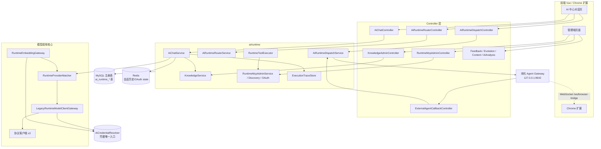
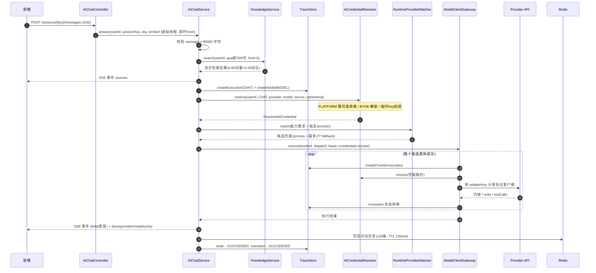
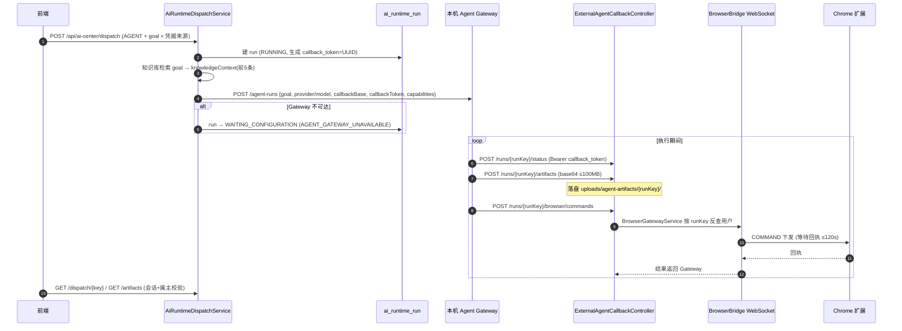
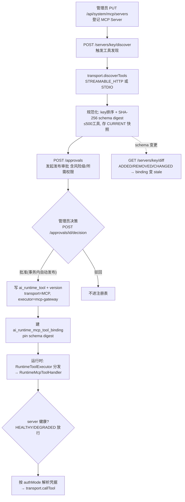
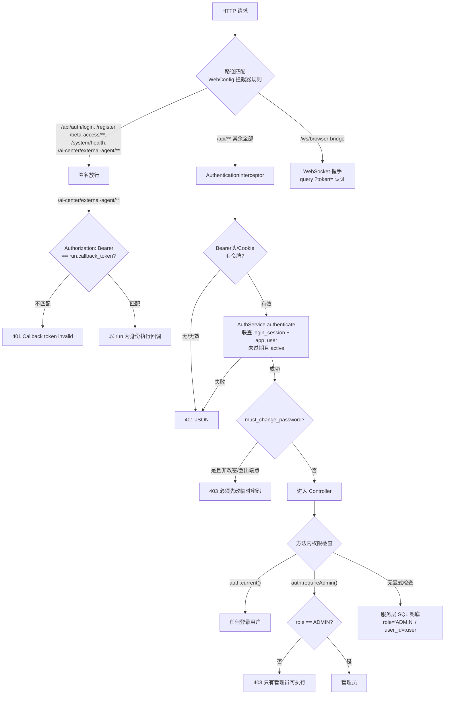
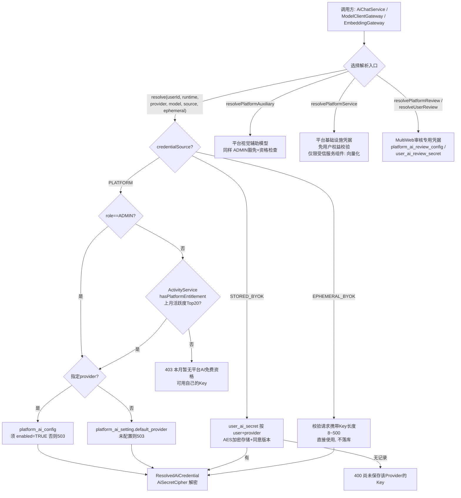

# Finals Compass AI Center 模块交接文档（Runtime 架构）

> 文档基线：2026-08-11，Flyway 迁移至 V54，分支 `feature/ai-analysis`
> 代码路径：`backend/src/main/java/cn/finalscompass/`，迁移：`backend/src/main/resources/db/migration/`


---

## 1. 一分钟理解现状

AI 模块经历过四代演进，前三代半的代码**已全部删除**，不要再找它们：

| 代际 | 形态 | 现状 |
| --- | --- | --- |
| V1 | Java 硬编码 Skill Bean + AiSkillRegistry | 已删除 |
| V2 | Guardrail→IntentRouter→SkillPlanner→ProviderGateway 编排链 | 已删除 |
| V3/V4 | 真实调用、临时拍题、Gemini+DeepSeek 双模型解题 | 已删除 |
| 过渡期 | workflow 运行时（AiCenterRuntimeController、文档生成、技能工作台） | **也已删除** |
| 当前 | `cn.finalscompass.ai.runtime`：注册表驱动 + 执行追踪 + 三 Runtime 路由 | **本文档描述对象** |

当前 `cn.finalscompass.ai` 下只有两个包：

- `ai/credential/` —— 共享凭据类型（`AiCredentialSource` 枚举：`PLATFORM` / `STORED_BYOK` / `EPHEMERAL_BYOK`；`ResolvedAiCredential` 为 `AutoCloseable`，close 时清零 apiKey 缓冲区）。
- `ai/runtime/` —— 新运行时全部实现（约 110 个类）。

另有三个关键支撑类仍在 `cn.finalscompass.service` 包下：`AiCredentialResolver`（唯一取 Key 入口）、`AiUsageGuardService`（限流配额，**当前未接线，见第 9 节**）、`AiAnalysisService`（dashboard 与 Key 管理）。

**改行为先查数据库注册表（provider/skill/tool/workflow 种子），再改代码。**

---

## 2. 模块全景

### 2.1 子包职责

| 子包 | 职责 | 关键类 |
| --- | --- | --- |
| `runtime/chat/` | AI 中心轻量对话：知识库 RAG + 直连模型，SSE 流式 | `AiChatService` |
| `runtime/routing/` | Runtime 目录与路由决策（CHAT / AGENT / MULTI_WEB_AGENT） | `AiRuntimeRouterService` |
| `runtime/provider/` | Provider 注册表、选型匹配、面向设置面板的目录 | `RuntimeProviderMatcher`、`RuntimeProviderCatalog`、`JdbcRuntimeProviderDefinitionRepository` |
| `runtime/provider/client/` | 协议客户端适配器（仅 3 个）：`deepseek-chat-v1`、`gemini-generate-content-v1`、`openai-responses-v1` | `RuntimeProviderClientRegistry` |
| `runtime/provider/embedding/` | 向量嵌入网关（知识库用） | `RuntimeEmbeddingGateway`、`OpenAiRuntimeEmbeddingClient` |
| `runtime/model/` | 模型调用网关：primary+fallback 候选遍历、trace 记录、工具多轮 | `LegacyRuntimeModelClientGateway`（当前唯一实现，"Legacy" 仅相对未来网关而言） |
| `runtime/tool/` | 工具注册表与执行：allowlist→定义→权限→入参 schema→handler→出参校验 | `RuntimeToolExecutor` |
| `runtime/mcp/` | MCP Server 接入：发现、审批治理、OAuth、运行时调用 | `RuntimeMcpAdminService`、`RuntimeMcpDiscoveryService`、`RuntimeMcpOAuthService`、`RuntimeMcpToolHandler` |
| `runtime/agent/` | 外挂 Agent 调度 + 浏览器命令中继 | `AiRuntimeDispatchService`、`BrowserGatewayService` |
| `runtime/knowledge/` | 知识库：入库→切块→向量化；混合检索（0.65 向量 + 0.35 词法） | `KnowledgeService`、`KnowledgeChunker` |
| `runtime/content/` | AI 中心页面内容（USAGE_GUIDE / VCP_INTRO 两页，版本化） | `AiCenterContentService` |
| `runtime/feedback/` | 反馈采样、提交、优化队列 | `AiFeedbackService` |
| `runtime/evolution/` | 日指标聚合与优化建议（管理端仪表盘） | `AiEvolutionService` |
| `runtime/trace/` | 三层执行追踪（execution→node→provider_invocation）+ 状态机 | `JdbcRuntimeExecutionTraceStore`、`RuntimeTraceStateMachine` |

### 2.2 组件关系



---

## 3. 业务图（核心链路）

### 3.1 三种 Runtime

`AiRuntimeRouterService.catalog()` 暴露三种运行时；`LEGACY` / `WORKFLOW` 枚举仍存在于 trace 层，但**路由已禁止新请求进入**（注册表保留、入口收窄的过渡状态）：

| Runtime | 状态 | 说明 |
| --- | --- | --- |
| CHAT | AVAILABLE | 知识库 RAG + 直连模型，SSE 流式，不生成文件 |
| AGENT | FOUNDATION | 外挂本机 Agent Gateway 执行，回调上报 |
| MULTI_WEB_AGENT | EXPERIMENTAL | 多 WebAgent 参与者（KIMI/DEEPSEEK/QWEN），依赖 Chrome 扩展 |

路由启发式：目标含"pdf/文档/生成"→AGENT；含"多网页/kimi/qwen"→MULTI_WEB_AGENT；否则 CHAT。选 MULTI_WEB_AGENT 但客户端无 `CHROME_EXTENSION` 能力时回退 AGENT。

### 3.2 CHAT 对话链路

入口：`POST /api/ai-center/chat/sessions` 建会话 → `POST /api/ai-center/chat/sessions/{sessionKey}/messages`（SSE）。



要点：

- system prompt 注入知识库材料并要求 `[n]` 引用；历史对话从 Redis 取（最多 20 条）。
- `credentialPurpose=MULTIWEB_REVIEW` 时改走 `resolveUserReview(...)`，且默认不带知识库。
- 失败路径：node→FAILED、execution→FAILED（errorCode=CHAT_FAILED），SSE 推 `error`。

### 3.3 AGENT 调度链路（外挂式，后端只做编排）

真正的 Agent 执行在本机 Agent Gateway（默认 `http://127.0.0.1:8642`，可被 `ai_agent_definition` 表覆盖），后端只负责建 run、下发目标、收回调。浏览器操作经 WebSocket 中继到用户的 Chrome 扩展。



MULTI_WEB_AGENT 分支不生成 callback_token，run 初始为 `WAITING_EXTENSION`，为每个 provider 建 `ai_web_agent_participant`（角色 RESEARCHER/ANALYST/REVIEWER），由前端经 `POST /dispatch/{key}/participants` 上报进度；全员完成→SYNTHESIZING，汇总完成→WAITING_AGENT_REVIEW。

### 3.4 MCP 工具治理链路（发现 → 审批 → 发布 → 调用）

**未批准的外远端工具不会进入运行时工具注册表**——这是治理闭环的核心。



OAuth 子流程（PLATFORM_OAUTH / USER_OAUTH）：管理员 `POST /servers/{key}/oauth/authorize` 生成 PKCE+S256 授权 URL（state 存 Redis，TTL 8 分钟）→ 提供商回调 `GET /api/system/mcp/oauth/callback`（state 一次性消费防重放）→ token 经 `AiSecretCipher` 加密存入 `ai_runtime_mcp_oauth_connection`（`user_id=0` 表示平台级连接）。过期前 60 秒自动 refresh。

### 3.5 知识库（RAG）链路

```mermaid
flowchart LR
    subgraph 入库(仅管理员)
        A[POST /api/system/knowledge/<br/>ingest-markdown 或 ingest-file] --> B[AiDocumentConversionService<br/>转 Markdown]
        B --> C[KnowledgeChunker<br/>~1800字符/段边界切块]
        C --> D[RuntimeEmbeddingGateway<br/>64条/批向量化]
        D --> E[knowledge_chunk + embedding<br/>记录 embedding_job]
    end
    subgraph 检索(聊天时自动)
        Q[用户问题] --> R[取范围内最近1000块<br/>PUBLIC / USER:id / COURSE]
        R --> S[混合打分 = 0.65×余弦<br/>仅同模型同维度 + 0.35×词法命中]
        S --> T[Top-N 注入 system prompt]
    end
```

知识库检索也作为 Runtime Tool 暴露（`KnowledgeSearchRuntimeToolHandler`，executorKey=`knowledge-search-v1`），供模型工具调用。

### 3.6 反馈与演进闭环

- **反馈**：前端先 `POST /feedback/offers` 请求邀请（按 triggerType 采样率 0.05~0.5 + 6 小时冷却）→ `POST /feedback` 提交，事务内写反馈并生成 skill/provider/tool 三张快照；负反馈自动入 `ai_pending_skill_optimization` 队列（CONTENT/UNDERSTANDING 错误优先级 80，其余 50）。
- **演进**：管理员 `POST /api/system/ai-evolution/refresh?date=` 从 trace 表聚合四张日指标表，按规则生成建议（负反馈率≥15% 且反馈≥3；执行≥10 且失败率≥10%），`GET /api/system/ai-evolution` 看 30 天仪表盘，`POST /recommendations/{id}/review` 审批。

---

## 4. 权限图（安全模型）

### 4.1 总原则

**本项目没有用 Spring Security**（pom 里只有 `spring-security-crypto` 做 BCrypt）。没有 SecurityFilterChain、没有 JWT、没有任何 `@PreAuthorize`。全部鉴权是命令式的三层：

1. **拦截器层**：`AuthenticationInterceptor` 拦 `/api/**`，校验会话令牌；
2. **控制器层**：方法体内手工调 `auth.current(request)`（需登录）或 `auth.requireAdmin(request)`（需 ADMIN，否则 403）；
3. **服务层**：SQL 内联 `role='ADMIN'` 判断 + `user_id=:user` 属主隔离。

会话令牌是**随机 UUID（非 JWT）**，存 `login_session` 表，有效期 7 天；来源为 `Authorization: Bearer` 头或 Cookie `finals_compass_session`。

角色只有两个：`ADMIN`（启动时由 `AdminBootstrapService` 从环境变量创建）和 `USER`（管理员人工发放的内测账号，公开注册恒返回 403）。



### 4.2 端点权限矩阵（AI 相关全集）

**任何登录用户（USER/ADMIN）**

| 端点 | 控制器 | 说明 |
| --- | --- | --- |
| `POST /api/ai-center/chat/sessions`、`POST .../messages`(SSE) | AiChatController | 对话 |
| `GET /api/ai-center/runtimes`、`POST /api/ai-center/route` | AiRuntimeRouterController | Runtime 目录/路由 |
| `POST/GET/DELETE /api/ai-center/dispatch/**` | AiRuntimeDispatchController | Agent 调度；服务层 SQL 强制 `user_id=:user` 属主隔离 |
| `GET /api/ai-center/content/{key}` | AiCenterContentController | 读已发布页面 |
| `POST /api/ai-center/feedback[/offers]`、`DELETE .../offers/{key}` | AiFeedbackController | 反馈 |
| `GET /api/ai/dashboard`、`PUT /api/ai/byok`、`DELETE /api/ai/byok/{provider}`、`PUT /api/ai/review-byok`、`POST /api/ai/attachments/convert` | AiAnalysisController | 仪表盘、Key 管理、附件转换 |

**仅 ADMIN（控制器内 `requireAdmin`）**

| 端点 | 控制器 | 说明 |
| --- | --- | --- |
| `PUT /api/ai/admin/platform-key`、`/platform-default`、`/platform-review-key` | AiAnalysisController | 平台 Key / 默认模型 / 审核 Key |
| `/api/system/mcp/**`（8 个端点） | RuntimeMcpAdminController | MCP 登记/发现/审批/OAuth |
| `/api/system/knowledge/**` | KnowledgeAdminController | 知识库入库与检索 |
| `PUT /api/ai-center/content/{key}` | AiCenterContentController | 页面内容更新（版本+1） |
| `GET/POST /api/system/ai-feedback/optimization[/{id}]` | AiFeedbackController | 优化队列 |
| `/api/system/ai-evolution/**` | AiEvolutionAdminController | 指标仪表盘/刷新/建议审批 |

**特殊认证通道**

| 通道 | 认证方式 |
| --- | --- |
| `/api/ai-center/external-agent/**` | 每 run 一次性 callback token（Bearer），runKey+token 双因子 |
| `/ws/browser-bridge` | 握手时 `?token=` 走同一 `AuthService.authenticate`；注意 `allowedOriginPatterns("*")` 不校验 Origin |
| `GET /api/system/mcp/oauth/callback` | 不校验管理员身份，靠 Redis 一次性 state（8 分钟 TTL）；仍在拦截器范围内需有效会话 |

### 4.3 凭据解析流程（花钱的边界，重点）

所有模型调用取 Key 只经 `AiCredentialResolver`。**来源由请求显式指定，不是平台优先自动降级**：



活跃度资格机制（原《AI活跃度资格与Skill安全架构设计》中仍然有效的部分）：`activity_event` 记积分（登录 1 / 提交资源 2 / 被采纳 5 / 内容被采纳 2），每月首次检查时把**上月活跃度前 20 名**写入 `ai_monthly_entitlement`（CHECK 约束 1–20），有当月记录才可用平台付费 AI；ADMIN 豁免所有限制。

### 4.4 运行时工具与 MCP 的权限

`RuntimeToolExecutor` 执行顺序（任一失败即拒绝）：

1. toolKey 必须在 Skill allowlist（`allowedTools`）内；
2. 查 `ai_runtime_tool` 定义（仅 ACTIVE + PUBLISHED current version）；
3. `grantedPermissions ⊇ requiredPermissions`；
4. 入参按 inputSchema 校验；
5. 分发给 handler（INTERNAL / `mcp-gateway`）；
6. 输出大小（maxResultBytes）与 outputSchema 校验。

MCP 凭据按 `authMode` 分发：`NONE`→空凭据；`PLATFORM_OAUTH`→subject=0 平台共享连接；`USER_OAUTH`→按 userId 隔离；**`SERVICE_TOKEN` 枚举存在但没有 resolver 实现，真用会抛异常**。

### 4.5 隐私与安全设计（已内置，勿破坏）

- `JdbcRuntimeExecutionTraceStore` 有 FORBIDDEN_JSON_FIELDS 黑名单：trace metadata 中禁止出现 rawinput/rawoutput/prompt/response/apikey/credential/secret 等字段。
- `ResolvedAiCredential`、`RuntimeMcpCredential` 均 `AutoCloseable`，close 清零敏感缓冲；一律 try-with-resources。
- 产物下载前校验存储路径必须在 `uploads/` 目录内（防路径穿越）；回调上传文件名只取 `Paths.getFileName`。
- MCP 的 STREAMABLE_HTTP 与 OAuth 端点强制 HTTPS。

---

## 5. 数据库注册表速查（V25–V54）

| 迁移 | 表 / 内容 | 用途 |
| --- | --- | --- |
| V25 | `ai_runtime_skill`、`ai_runtime_skill_version` | Skill 注册表：executor、prompt 模板、输入输出 schema、权限/重试策略、checksum |
| V26 | `ai_runtime_provider`、`_endpoint`、`_model`、`ai_runtime_capability`、`_model_capability` | Provider 注册表：接入点优先级/超时、模型能力/定价/路由权重 |
| V27 | `ai_runtime_execution`、`_node`、`ai_runtime_provider_invocation`、`_execution_event` | 三层执行追踪 |
| V28/V29 | 种子数据 | 7 种能力 + Provider/模型/端点；初始 Skill（解题、提示、检查等） |
| V30/V31 | `ai_runtime_workflow`、`_version`、`_node`、`_edge` + 种子 | Workflow DAG 注册表（当前路由已不收窄到新请求） |
| V32 | `ai_runtime_tool`、`ai_runtime_tool_version` | Tool 注册表：风险级、transport、executor、schema、权限策略 |
| V33 | `ai_runtime_mcp_server`、`_discovery_snapshot`、`_discovered_tool`、`_tool_binding` | MCP 登记、发现快照、工具绑定（pin digest） |
| V34 | `ai_runtime_mcp_oauth_connection`、`ai_runtime_mcp_approval` | OAuth 加密 token、工具准入审批 |
| V35/V36 | `knowledge_source`、`knowledge_document`、`knowledge_chunk`、`knowledge_embedding_job` | 知识库基础与向量化管道 |
| V37/V38 | `document_template`、`document_generation_job`、`document_artifact` + Skill 种子 | 文档生成（表仍在，调用入口已随过渡期代码删除） |
| V39 | `ai_feedback_prompt`、`ai_task_feedback`、三张快照表、`ai_pending_skill_optimization` | 反馈与优化队列 |
| V40 | `ai_evolution_run`、四张日指标表、`ai_skill_optimization_recommendation` | 演进分析 |
| V41 | `ai_skill_change_request`、评测三表、`ai_skill_release` | Skill 版本工作台（表在，端点已删） |
| V42/V43 | `ai_center_content_page` + HTML 内容种子 | AI 中心页面 |
| V44 | `ai_agent_definition`、`ai_runtime_run`、`ai_browser_extension_session`、`ai_web_agent_participant` | Agent/WebAgent 运行时 |
| V45–V50 | 结构调整与种子 | structured_output/内容格式、海报工作流、模型限额回填、文档规划 Skill 修订 |
| V51 | direct-qa workflow 种子 | — |
| V52 | `ai_runtime_run.callback_token` + 产物列 | Gateway 回调认证与产物上传 |
| V53 | `platform_ai_review_config`、`user_ai_review_secret` | MultiWeb 审核凭据 |
| V54 | chat runtime 执行放行 | CHAT 链路收尾 |

新迁移从 **V55** 开始。

---

## 6. 关键类速查表

| 想做什么 | 看哪里 |
| --- | --- |
| 改聊天行为 / SSE 事件 | `runtime/chat/AiChatService` |
| 加新模型协议 | 实现 `RuntimeProviderProtocolClient`（adapterKey），注册为 Bean；同步加 DB provider 种子 |
| 改选型逻辑 | `RuntimeProviderMatcher.match` + `ProviderSelectionRequest` |
| 改凭据规则 | `service/AiCredentialResolver`（唯一入口，勿绕过） |
| 改追踪字段/状态 | `runtime/trace/`，注意 FORBIDDEN_JSON_FIELDS 与状态机合法转移 |
| 加内置工具 | 实现 `RuntimeToolHandler`（executorKey）+ `ai_runtime_tool` 种子 |
| 接 MCP Server | 管理端 `/api/system/mcp/**` 全流程，服务看 `RuntimeMcpAdminService` |
| 改 Agent Gateway 协议 | `AiRuntimeDispatchService.invokeAgent` + `ExternalAgentCallbackController`，protocolVersion=1.0 |
| 改浏览器中继 | `BrowserGatewayService` + `config/BrowserBridgeWebSocketConfig/Handler` |
| 改知识库切块/打分 | `KnowledgeChunker`、`KnowledgeService.search` |
| 改资格规则 | `service/ActivityService`（Top20 常量在 V17 CHECK 约束里） |

---

## 7. 配置项

`application.yml` 中 AI 相关键（前缀 `app.ai`）：

- `limits.calls-per-minute`（默认 6）、`platform-daily-calls`（20）、`platform-monthly-tokens`（100000）——供 AiUsageGuardService 使用（见第 8 节现状）；
- `agent-gateway.url`（默认 `http://127.0.0.1:8642`）——Agent Gateway 兜底地址（`ai_agent_definition` 表优先）；
- 管理员引导：`app.bootstrap-admin.username/password`（环境变量 `APP_ADMIN_USERNAME`/`APP_ADMIN_PASSWORD`，密码 ≥12 位）。

---

## 8. 交接陷阱与已知缺口

1. **`AiUsageGuardService` 是孤儿**：限频（每分钟 6 次）与平台日/月配额已实现，但旧调用方随 agent/task 包删除后**没有任何类调用 `check()`**。当前实际生效的门槛只有"活跃度 Top20 资格"。**请尽早决定是接线到 AiChatService/Dispatch 还是删除。**
2. **MCP `SERVICE_TOKEN` 模式未实现**：枚举和 DB CHECK 允许，但没有凭据 resolver，真用会抛 "credential resolver is unavailable"。
3. **LEGACY / WORKFLOW 处于"注册表保留、入口收窄"状态**：表、种子、V40/V41 指标都还在，但 Router 拒绝新请求进入。清理前先确认演进分析不再需要这些数据。
4. **死引用残留**：`deploy/nginx/finals-compass.conf` 仍有 `location = /api/ai/invoke`；`src/api.js` 仍有 `aiApi.invoke` 指向已删端点。后端该端点已不存在，可清理。
5. **WebSocket 握手**：token 走 URL query 参数，且 `allowedOriginPatterns("*")`，安全评审时留意。
6. **OAuth callback 端点**不校验管理员身份，仅靠一次性 state（已在拦截器范围内需有效会话）。
7. **文档生成 / 技能工作台**的表（V37/V38/V41）仍在库中但无 HTTP 入口，属过渡期遗产，别误以为功能还在。
8. `LegacyRuntimeModelClientGateway` 的名字带 "Legacy" 只是相对未来网关而言，它就是当前唯一实现，不要删。
9. 前端 `/ai-center/workflow` 路由已重定向到 `/ai-center/chat`（CHAT 模式）；`AiAnalysisView.vue` 已删除。

---

## 9. 相关文档

- [MarkItDown 内置附件解析与运行指南](MarkItDown内置附件解析与运行指南.md) —— 附件转 Markdown 的 Worker 链路（仍被 `/api/ai/attachments/convert` 与知识库 ingest-file 使用；文中对旧 Skill 架构的引用作废）。
- [系统架构与设计总览](系统架构与设计总览.md) —— 非 AI 章节有效；AI 数据流章节以本文为准。
- [安全审计报告](安全审计报告.md) —— 2026-08-09 时点快照，未覆盖 chat 重构后的新链路。
- [MySQL 数据库设计详解](MySQL数据库设计详解.md) —— 仅覆盖 V1–V15 基础库。
