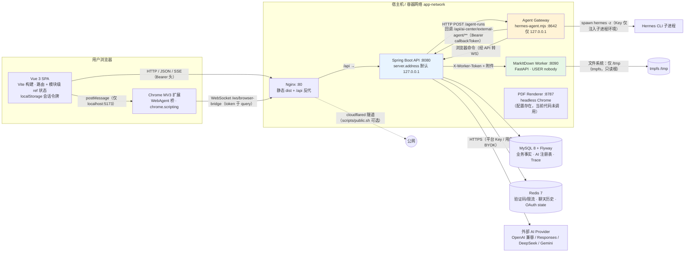
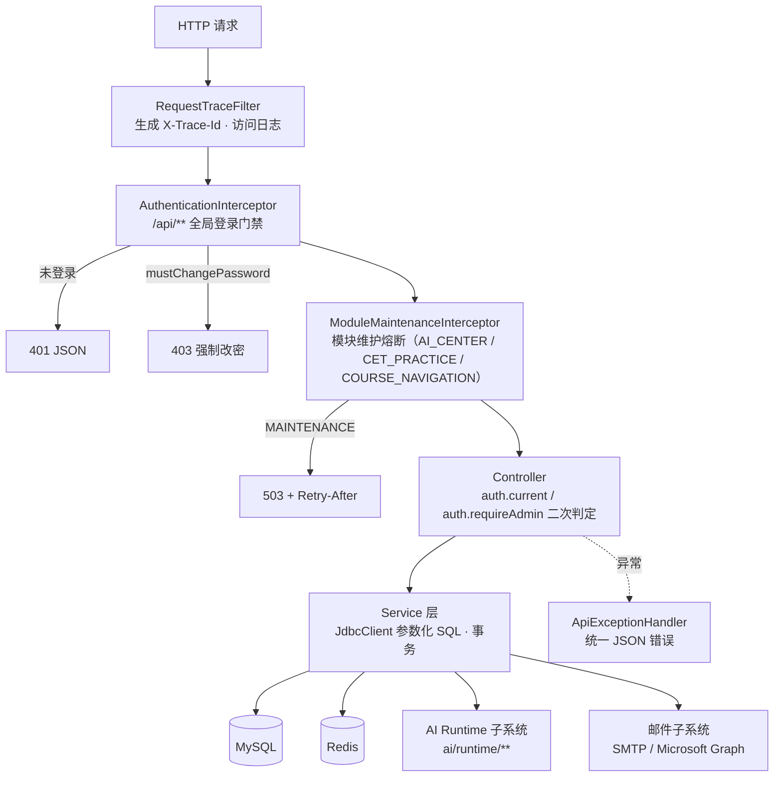
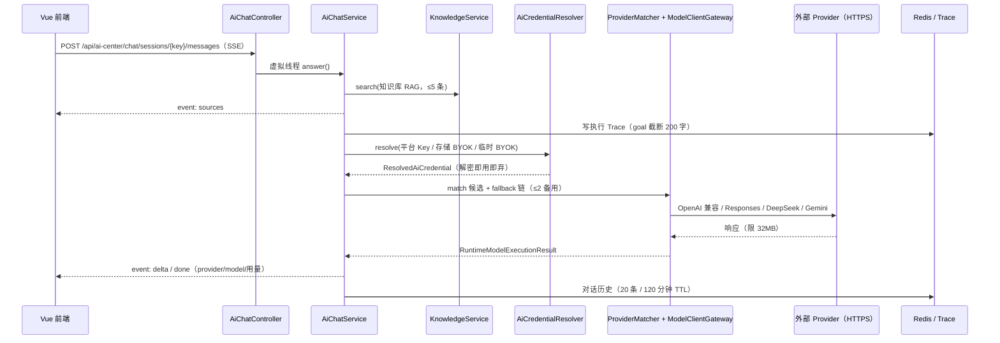
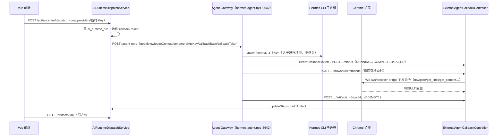

# Finals Compass 架构快照（V58）

> **历史快照**：本文生成于 2026-08-14，基线为 Flyway V58，不覆盖后来加入的 liveDoc/Scriptorium、CET 结构调整、浏览器绑定强化和专业目录（V59–V73）。当前入口请先读 [项目 README](../README.md)、[文档目录](README.md) 与 [liveDoc 维护指南](liveDoc与Scriptorium维护指南.md)。下文保留用于追溯当时的架构与安全判断。

> **基线声明**：本文档描述代码仓库**当前阶段**（main @ ff9ea17，2026-08-13，含工作区未提交的 V58 与 AiAnalysis/管理后台改动；Flyway 最新迁移 V58）的实际架构。所有结论均由本次代码通读核实，可回溯到文件与行号。
> **定位**：本文是现阶段架构的权威快照，用于整体把握“Vue 前端 / Spring Boot 后端 / MySQL / Redis / 浏览器扩展 / Agent Gateway / 辅助服务 / 部署”的协作关系。历史视角（V1–V4、旧 Workflow 页面、旧解题链路）见 系统架构与设计总览.md 与 AI模块研发交接文档.md；两者与本篇冲突时，以本篇和当前代码为准。
> **配套**：安全维度见同目录 安全审查报告.md（2026-08-14，独立于历史 安全审计报告.md）。

---

## 1. 全景架构图



**一句话描述**：前端 SPA 与 Spring Boot API 通过 Nginx 同源通信；后端把业务事实写入 MySQL、把短期状态写入 Redis；AI 能力分为三条链路——Chat 由后端直连外部大模型，Agent 由本机 Agent Gateway 驱动 Hermes CLI 并回调回传结果，MultiWeb Agent 借 Chrome 扩展复用用户网页登录态，由扩展经 WebSocket 受后端调度。

---

## 2. 前端架构

### 2.1 路由与应用外壳

路由表（apps/web/src/main.js:16-28，createWebHistory）：

| 路径 | 视图 | 说明 |
| --- | --- | --- |
| / | HomeView | 学院/课程导航首页 |
| /courses/:courseId | TeachersView | 课程任课老师 |
| /courses/:courseId/teachers/:teacherId | TeacherCircleView | 老师圈（资料/讨论/复习指南） |
| /cet | CetView | 英语等级考试（题库/试卷/听力） |
| /ai-center | AiCenterView | AI Center 入口与 Runtime 路由决策 |
| /ai-center/chat | AiRuntimeChatView（meta.runtime=CHAT） | Chat Runtime 对话 |
| /ai-center/agent | AiRuntimeChatView（meta.runtime=AGENT） | Agent Runtime 对话 |
| /ai-center/web-agent | AiRuntimeChatView（meta.runtime=MULTI_WEB_AGENT） | MultiWeb Agent 对话 |
| /ai-center/vcp | VcpRuntimeView | VCP 未来 Runtime 介绍页（内容来自 DB） |

- 旧路径 /ai-analysis、/ai-center/workflow 均为重定向（apps/web/src/main.js:19,22）；AuthView 与 ModuleMaintenanceView 不入路由，由 App.vue 按认证状态/模块状态条件渲染。
- 应用外壳 App.vue 负责：开场过渡动画、认证门控（未登录显示 AuthView）、强制改密弹窗、公告加载、管理员浮层（审核/发号/SMTP/MCP/反馈/问卷/暂挂/模块维护）。
- 认证与模块维护的**真实门禁在后端**（拦截器 + 角色校验），前端 isAdmin 仅控制 UI 显隐。

### 2.2 状态管理与请求封装

- 无 Pinia/Vuex：会话与身份用 apps/web/src/api.js 模块级 ref/computed 单例（authSession、authenticated、isAdmin、profile，api.js:9-12）；AI 凭据面板状态在 apps/web/src/aiCenterSettings.js 的 reactive 单例。
- 统一 request()/requestBlob() 封装：使用 `credentials: include` 携带 HttpOnly 会话 Cookie；非安全方法自动附加双提交 `X-CSRF-Token`，401 时清会话，错误透传 X-Trace-Id。
- 浏览器会话不再把令牌写入 localStorage；刷新时通过 `GET /api/auth/session` 恢复公开资料。Bearer 仅保留给浏览器扩展、外部 Agent 回调等非浏览器集成。
- Chat SSE 由 fetch 流式读取并手工解析 event:/data: 帧（api.js:266-279，AiRuntimeChatView.vue:109-149）。

### 2.3 渲染安全管线（XSS 收敛点）

全仓仅两处 v-html，全部经 DOMPurify：

- SafeHtml.vue：DOMPurify.sanitize(html, {USE_PROFILES:{html:true}})。
- SafeMarkdown.vue：marked（gfm）→ 代码块外数学公式替换为 KaTeX（trust:false、throwOnError:false）→ DOMPurify.sanitize(..., {USE_PROFILES:{html:true,svg:true,mathMl:true}}) → v-html。
- AI 回复、AI Center 页面内容（VCP/使用指南）、管理端预览均经上述组件渲染；社区内容（讨论/指南/公告）用 {{ }} 插值，Vue 自动转义。

---

## 3. 后端架构

### 3.1 分层与请求处理链



- **认证模型**：无 Spring Security 全家桶（仅 spring-security-crypto 的 BCrypt）。登录后 DB 表 login_session 存随机 UUID 令牌（7 天过期）；浏览器使用 HttpOnly、SameSite=Lax 的 finals_compass_session Cookie，并以双提交 Cookie 防护写请求 CSRF；Bearer 保留给受控外部集成。
- **匿名豁免路径仅 5 个**（WebConfig.java:28-33）：/api/auth/login、/api/auth/register（恒 403）、/api/auth/beta-access/**、/api/system/health、/api/ai-center/external-agent/**（后者由每次运行生成的 callbackToken 自行鉴权）。
- **管理员判定**：role='ADMIN' + 控制器内显式 auth.requireAdmin（AuthService.java:87-91）。
- **数据访问**：全库 JdbcClient 命名参数；唯一字符串拼接是固定白名单常量（Cet/Circle/System 的过滤片段与表名白名单），无 SQL 注入面。

### 3.2 端点鉴权一览

| 控制器（前缀） | 主要路由 | 鉴权 |
| --- | --- | --- |
| AuthController /api/auth | beta-access/request、/verify、/login、/register（恒 403） | 匿名 |
|  | stream-cookie、change-password、logout | 登录 |
| IdentityController /api/identity | POST /anonymous | 登录 |
| CatalogController /api/courses | GET /、/colleges、/{slug}/teachers | 登录 |
|  | POST /colleges、POST /、POST /{slug}/teachers | 管理 |
| CetController /api/cet | GET /papers、/papers/{id}/assets、/items、/items/{id}/audio | 登录 |
|  | POST/PUT/DELETE 试卷与题目、POST 音频 | 管理 |
| CircleController /api/circles/{c}/{t} | GET 资源/文件/讨论/摘要/指南；POST 上传/感谢/讨论/指南投稿 | 登录 |
|  | PUT /guide、GET /guide/submissions | 管理 |
| MailAdminController /api/system/mail | SMTP 保存与测试、模板、发号审批、昵称建议 | 管理 + 管理员密码复验 |
| MicrosoftMailController /api/system/mail/microsoft | authorize、callback、test-and-enable、解绑 | 管理 + 密码复验（callback 依赖会话 Cookie） |
| SurveyController /api/survey | GET 题目、POST /submissions | 登录（管理员禁提交） |
|  | GET /admin、PUT /admin/questions | 管理 |
| SuspendController /api/suspend | GET /config、GET /videos/{id} | 登录 |
|  | GET /admin、PUT /admin/config、POST /admin/videos | 管理 |
| SystemController /api/system | GET /health | 匿名 |
|  | GET /announcement | 登录 |
|  | PUT /announcement、/metrics、/moderation、/beta-access、DELETE /discussions/{id} | 管理 |
| SystemModuleController /api/system/modules | GET | 登录；PUT /{key} 管理 |
| AiRuntimeRouterController /api/ai-center | GET /runtimes、POST /route | 登录 |
| AiChatController /api/ai-center/chat | POST /sessions、/sessions/{key}/messages（SSE） | 登录 |
| AiRuntimeDispatchController /api/ai-center/dispatch | 启动/查看/取消/参与者上报/产物下载 | 登录（按 runKey+userId 归属校验） |
| AiCenterContentController /api/ai-center/content | GET /{key} | 登录；PUT 管理 |
| AiAnalysisController /api/ai | dashboard、byok、review-byok、vision-byok、vision/analyze、attachments/convert | 登录 |
|  | /admin/platform-key、/admin/platform-default、/admin/internal-test-access、/admin/platform-review-key、/admin/vision-features | 管理 |
| AiFeedbackController /api/ai-center/feedback | offers、submit | 登录；/system/ai-feedback/optimization 管理 |
| AiEvolutionAdminController /api/system/ai-evolution | dashboard、refresh、recommendations review | 管理 |
| KnowledgeAdminController | 知识库 ingest/列表/启用等 | 管理 |
| RuntimeMcpAdminController /api/system/mcp | 服务器保存/发现/OAuth/审批 | 管理 |
| ExternalAgentCallbackController /api/ai-center/external-agent/** | runs/{key}、status、artifacts、browser/commands | 登录拦截器豁免；Bearer callbackToken 鉴权（每 run 随机） |
| SpaController | GET /courses/{id}、/courses/{id}/teachers/{id} → forward:/index.html | 静态 SPA 回退 |

> 维护熔断：ModuleMaintenanceInterceptor 按 URI 前缀映射 AI_CENTER / CET_PRACTICE / COURSE_NAVIGATION，维护期对非管理员返回 503（WebConfig.java:34 豁免 /api/system/modules/** 与 health）。

### 3.3 业务主链

1. **身份与社区链**：app_user → anonymous_user 匿名身份（昵称/公开 ID）→ 资源/讨论/指南投稿（PENDING）→ 管理员审核（moderation_audit）→ ActivityService 计分 → 月度排行榜生成 AI 配额（ai_monthly_entitlement）。
2. **邮箱验证与账号发放链**：Beta 申请（Redis HMAC 验证码 + Lua 原子限流）→ AccountAllocationService 行锁串行发号 → 管理员审批开号（BCrypt 临时密码 + 强制首登改密）→ DynamicMailService 经 mail_provider_setting 二选一投递：SMTP（MailSecretCipher 加密配置）或 Microsoft Graph（PKCE OAuth + 加密 refresh token）。
3. **学习资源链**：资源上传（扩展名白名单 + 20MB + PENDING）→ 审核 → 发布 → 感谢/讨论/指南引用；文件服务全部 normalize + startsWith 路径校验。

### 3.4 模块维护熔断

SystemModuleService 维护三块（AI_CENTER、CET_PRACTICE、COURSE_NAVIGATION）的运行状态；ModuleMaintenanceInterceptor 按 URI 前缀映射（ModuleMaintenanceInterceptor.java:22）对非管理员返回 503 + Retry-After，保证前端维护页被绕过时后端仍拒流。

---

## 4. AI Center Runtime（当前对外仅三种：CHAT / AGENT / MULTI_WEB_AGENT）

### 4.1 Runtime 路由决策

```mermaid
flowchart TD
  IN[/api/ai-center/route · goal] --> R{AiRuntimeRouterService}
  R -->|goal 含网页协作关键词| W[MULTI_WEB_AGENT]
  R -->|goal 含调研/生成/文件关键词| A[AGENT]
  R -->|默认| C[CHAT]
  W -->|扩展未连接| A
  W -->|扩展已连接| WS[等待扩展参与者]
  A --> GW[下发 Agent Gateway]
  C --> CHAT[知识库 RAG 问答]
  R -.LEGACY / WORKFLOW 显式拒绝.-> X[IllegalArgumentException]
```

关键词启发式（AiRuntimeRouterService.java:20-26）：WEB_AGENT_HINTS（多网页/kimi/qwen…）与 AGENT_HINTS（自主/调研/生成/文件/pdf/海报…）；客户端能力卡 CHROME_EXTENSION 缺失时 MultiWeb 自动回退 Agent（:80-86）。

### 4.2 CHAT 链路（RAG + SSE）



- 历史上下文存 Redis fc:chat:{userId}:{sessionKey}，键含 userId，无跨用户串读。
- 主模型失败自动降级候选模型（AiChatService.java:219-224）；凭据来源 PLATFORM / STORED_BYOK / EPHEMERAL_BYOK 三选一（临时 Key 仅驻留内存，不落库）。

### 4.3 AGENT 链路（本地 Agent Gateway）



- 网关默认 http://127.0.0.1:8642，gateway_url 可由 ai_agent_definition 表覆盖（AiRuntimeDispatchService.java:101-107），环境变量 AGENT_GATEWAY_URL 兜底。
- 回调端点被登录拦截器豁免，但**每个 run 的随机 callbackToken 即鉴权凭据**（dispatch.authenticateCallback，:171-182）。
- 网关进程仅监听回环；任务超时 30 分钟；产物走临时工作目录，结束即删除。

### 4.4 MULTI_WEB_AGENT 链路（Chrome 扩展复用登录态）

- 前端 AiRuntimeChatView（meta.runtime=MULTI_WEB_AGENT）与扩展通过 window.postMessage 桥接（bridge.js:3-21），扩展在用户已登录的 Kimi/DeepSeek/通义页面执行网页任务。
- 后端：start 落 WAITING_EXTENSION + 种子参与者（默认 KIMI/DEEPSEEK/QWEN）→ 扩展经用户会话鉴权上报 POST /{key}/participants → 全参与者完成进入 SYNTHESIZING → 平台 Critic（platform_ai_review_config 的审核模型）融合复核 → WAITING_AGENT_REVIEW → 完成。
- 浏览器控制面由 BrowserGatewayService 管理：userId→WebSocket 会话、commandId→CompletableFuture 配对（BrowserGatewayService.java:28-30,70-106）。

### 4.5 AI 治理基础设施（注册表与状态机）

| 子系统 | 关键类 | 现状 |
| --- | --- | --- |
| Provider/Model/Endpoint 注册表 | RuntimeProviderDefinitionRepository（V26/V28/V55 种子）、RuntimeProviderMatcher、Validator | 活跃；base_url 仅迁移可写，无在线编辑 API |
| 客户端适配器 | DeepSeek / GeminiGenerateContent / OpenAI-ChatCompatible / OpenAI-Responses | 活跃，按 adapterKey 注册 |
| 出站 HTTP | JdkRuntimeHttpTransport | https 任意 host；http 仅回环；响应 ≤32MB；头校验防 CRLF |
| 凭据解析 | AiCredentialResolver + AiSecretCipher（AES-256-GCM） | 平台 Key/存储 BYOK/临时 BYOK 三源统一入口 |
| 用量守卫 | AiUsageGuardService | **已建成但全仓无调用（见安全报告）** |
| MCP 治理 | RuntimeMcpAdminService：发现→规范化→审批→发布为工具 | 工具轮已建成；executeWithTools 尚无调用方 |
| 知识库 | KnowledgeService + KnowledgeChunker + Embedding | 活跃（CHAT RAG 与 AGENT 上下文）；Java 侧线性扫描，无向量索引 |
| Trace | RuntimeTraceStateMachine + JdbcRuntimeExecutionTraceStore | 活跃；敏感字段名拒写 |
| 反馈/演化 | AiFeedbackService、AiEvolutionService | 活跃（管理员工作台） |
| 内容页 | AiCenterContentService（USAGE_GUIDE / VCP_INTRO） | 活跃；前端经 SafeHtml/SafeMarkdown 渲染 |
| 视觉辅助 | AiVisionService（图片→结构化文本，独立视觉凭据通道） | 活跃 |

### 4.6 凭据边界（密钥流向）

```mermaid
flowchart LR
  K1[平台 Key<br/>platform_ai_config / review_config] --> CIPHER[AiSecretCipher<br/>AES-256-GCM · 随机 12B IV<br/>主密钥 = AI_SECRET_ENCRYPTION_KEY]
  K2[用户存储 BYOK<br/>user_ai_secret / review / vision] --> CIPHER
  K3[临时 BYOK<br/>仅当前请求 char[]] --> MEM[内存 · close() 清零]
  CIPHER --> DB[(DB：ciphertext + iv + SHA-256 指纹前 12 位)]
  CIPHER -->|调用时即时解密| RES[ResolvedAiCredential]
  RES -->|HTTPS Bearer| API2[外部 Provider]
  RES -.AGENT 路径：明文随网关请求体.-> GW2[本机 Agent Gateway]
  K3 --> MEM
```

- 主密钥为单一静态 Base64 32 字节，无 KMS/轮换；改钥后历史密文不可读（application.yml:41 注释已声明）。
- Trace/日志拒写 key/secret 字段；执行表只存 goal_summary(≤200) 与 error_summary(≤500)。

---

## 5. 数据层（Flyway V1–V58）

| 主题 | 迁移 | 核心表 |
| --- | --- | --- |
| 基础业务 | V1 | app_user、college、program、course、teacher、login_session、resource、discussion、study_guide、anonymous_user |
| 账号/审核/激励 | V2、V3、V4、V5、V8、V9、V10、V13 | moderation_audit、resource_thank、beta_access_request、user_feedback_survey、login_announcement |
| 课程/CET/暂挂 | V6、V7、V11、V12、V14、V15、V16 | cet 题库/试卷/听力、shared_courses、suspend 配置 |
| AI 凭据与活动 | V17 | ai_usage_log、ai_monthly_entitlement、platform_ai_setting/config、user_ai_secret |
| 邮件与发号 | V18、V19、V20 | beta_access_request 扩展、smtp_configuration、mail_template、mail_provider_setting、account_provisioning |
| AI Runtime 注册表 | V21–V34 | ai_prompt_template、ai_agent_definition、platform 默认、skill/workflow/tool/mcp 注册表、执行 Trace |
| 知识库/文档/反馈 | V35–V41 | knowledge_source/chunk、embedding、document_*、ai_task_feedback、ai_evolution |
| 当前 Runtime 收敛 | V42–V58 | ai_center_content_page、ai_runtime_run(_artifact)、ai_web_agent_participant、platform_ai_review_config、user_ai_vision_secret、ai_feature_setting、internal_test_open |

**遗留面（重要）**：V23 ai_task/ai_task_step、V25/V30/V31/V41/V46/V48–V51 的 skill/workflow/document 及提示词模板表、V37/V38 文档生成表仍驻留数据库，仅被仪表盘/演化指标**只读**引用；RuntimeType.LEGACY/WORKFLOW 已被路由显式拒绝（AiRuntimeRouterService.java:108-110），Java 侧无执行入口、无 Controller 暴露，**外部调用面为零**。LegacyRuntimeModelClientGateway 名字带 Legacy，实为当前唯一模型网关实现（非死代码）。

---

## 6. 外围进程与部署拓扑

| 组件 | 语言/技术 | 监听 | 鉴权 | 关键约束 |
| --- | --- | --- | --- | --- |
| Agent Gateway（scripts/hermes-agent.mjs） | Node 22 | 仅 127.0.0.1:8642 | 无（仅回环可达） | 请求体 ≤64KB；Key 仅进子进程环境；产物 ≤100MB/个、Base64 回传 |
| 模拟网关（scripts/mock-agent.mjs） | Node | 仅回环 | 无 | E2E 协议测试 |
| MarkItDown Worker | Python 3.10+ / FastAPI | 容器内网 :8090 | X-Worker-Token（hmac.compare_digest） | 扩展名/魔数/解压比/页数/时长多重守卫；只读根 + tmpfs；并发 2 |
| PDF Renderer（services/pdf-renderer） | Node + headless Chrome | 127.0.0.1:8787 | x-renderer-token | **配置声明存在，当前 Java/前端均未调用（预留）** |
| Chrome 扩展（browser-extension） | MV3 | 连接 /ws/browser-bridge | 复用登录令牌（query 参数） | content_scripts 仅 localhost:5173；host_permissions 含 https://*/* |
| Docker Compose（deploy/） | — | backend 仅 127.0.0.1:8080；frontend 80（可选 profile） | — | MySQL/Redis/Worker 不对外发布端口；Redis requirepass + noeviction |
| Nginx（deploy/nginx） | nginx:1.28-alpine | :80 | — | /api 反代；/api/ai/invoke 流式直传；SPA fallback |
| 公网脚本（scripts/public.sh） | bash + cloudflared | 随机 trycloudflare 域名 | — | 仅暴露 127.0.0.1:8080，交互确认 |

---

## 7. 端到端典型数据流汇总

1. **登录**：前端 → POST /api/auth/login（BCrypt 比对）→ 写 login_session（7 天）→ 设置 HttpOnly 会话 Cookie 与 CSRF Cookie → 后续请求凭 Cookie 鉴权，写请求校验 `X-CSRF-Token`。
2. **社区投稿**：上传 → 扩展名白名单 + PENDING → 管理员审核 → PUBLISHED → 感谢/讨论/指南引用 → 计分 → 月度 AI 配额。
3. **CHAT 问答**：RAG 检索 → 凭据解析 → Provider 匹配（含备用链）→ HTTPS 调用 → SSE 增量返回 → Redis 历史 + Trace。
4. **AGENT 生成文件**：创建 run + callbackToken → 网关 hermes -z（可选浏览器检索）→ 状态/产物回调 → 前端轮询视图并下载产物。
5. **MultiWeb 协作**：扩展注册参与者 → 各站点执行 → 参与者上报 → Critic 审核 → 汇总结果。

---

## 8. 与既有文档的关系

- 本文 = **现阶段快照**（V58 + 当前代码）；系统架构与设计总览.md 保留历史演进描述（其部分结论如旧 Workflow 视图已被当前代码取代）。
- AI 模块实现细节以 AI模块研发交接文档.md 为准；本文提供跨模块全景与图。
- 数据表结构与范式以 MySQL数据库设计详解.md 为准；本文仅按主题分组。
- 安全结论见 安全审查报告.md（本次新产出）。

*生成日期：2026-08-14 · 代码基线：main @ ff9ea17（2026-08-13 提交）+ 工作区未提交改动（V58）。*
