# 期末指南：系统运行全景图与数学网络模型

> 阅读目标：从“用户点了一下”开始，理解请求怎样穿过网络、服务器、程序、数据库和文件系统，再把结果返回屏幕。  
> 适用版本：当前 `web_design / Finals Compass` 生产架构。  
> 阅读路径：先看第 1、2、5 节，再按需要深入数据库、数学模型和排障章节。

---

## 0. 先用一句话理解整个系统

这个项目可以看成一座有门卫、办事大厅、档案库和仓库的学校：

- **浏览器**是来办事的学生。
- **互联网**是从宿舍到学校的道路。
- **Nginx**是学校总门卫兼前台：静态页面直接发给你，需要办业务的请求转交后端。
- **Spring Boot**是办事大厅：验证身份、理解需求、执行规则。
- **MySQL**是结构化档案库：保存账号、课程、资料元数据、公告和审核状态。
- **Docker volume** 是文件仓库：保存真正的 PDF、图片和听力音频。
- **Vue** 是学生手中的交互表格：负责把数据画成页面，也把点击整理成 API 请求。

最重要的区分：

```text
页面长什么样       → Vue / CSS / 浏览器
业务能不能执行     → Spring Boot / 权限规则
有哪些结构化记录   → MySQL
PDF 和音频本体在哪 → uploads Docker volume
谁接收公网请求     → Nginx
```

---

# 第一部分：一张全景图

## 1. 生产系统网络拓扑

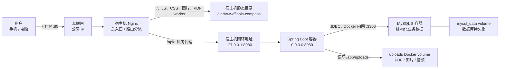

### 1.1 图中每条边代表什么

| 起点 → 终点 | 实际含义 | 数据形式 |
|---|---|---|
| 用户 → Nginx | 浏览器发 HTTP 请求 | URL、请求头、JSON、文件 |
| Nginx → 静态目录 | 查找已经构建好的前端文件 | HTML、JS、CSS、图片、MJS |
| Nginx → Spring Boot | 把 `/api` 请求转发到后端 | HTTP |
| Spring Boot → MySQL | 查询或修改业务记录 | SQL / 行记录 |
| Spring Boot → uploads | 保存或读取实际文件 | 字节流 |
| MySQL → mysql_data | Docker 将数据库文件持久化 | InnoDB 数据文件 |

### 1.2 为什么需要两条存储路线

MySQL 适合保存能检索、关联和排序的结构化信息：

```text
资料 ID、标题、上传者、状态、文件名、大小、创建时间
```

文件卷适合保存体积较大的原始字节：

```text
PDF 本体、Word 文件、图片、MP3 音频
```

因此一份资料在系统中是“一条档案 + 一个箱子”：

```text
MySQL resource 行
  storage_name = 8f...a2.pdf
             │
             └── 指向 uploads/8f...a2.pdf
```

只备份数据库，相当于只保存了仓库目录，没有保存箱子；只备份文件，相当于箱子都在，但不知道属于哪门课程、谁上传、是否审核通过。

---

## 2. 服务器内部部署结构

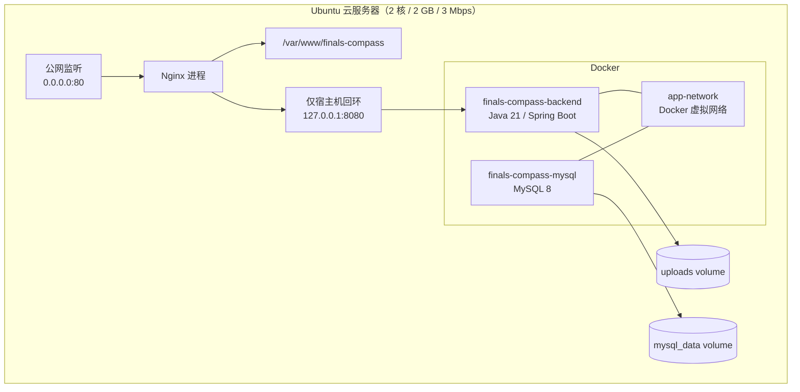

这里有三个容易混淆的“地址”：

| 地址 | 谁能访问 | 用途 |
|---|---|---|
| `公网 IP:80` | 互联网用户 | 系统正式入口 |
| `127.0.0.1:8080` | 只有服务器自己 | Nginx 转发后端 |
| `mysql:3306` | Docker `app-network` 内的容器 | 后端访问 MySQL |

`127.0.0.1` 的意思是“我自己”。但“谁是我”取决于所在网络空间：

- 在宿主机中，`127.0.0.1` 是 Ubuntu 宿主机。
- 在后端容器中，`127.0.0.1` 是后端容器自己，不是宿主机，也不是 MySQL。
- Docker 服务名 `mysql` 会在 Docker 内网解析为 MySQL 容器地址。

这就是之前“容器显示 Up，但访问 8080 连接重置”的根本背景：Spring 当时只监听容器自己的回环地址，Docker 端口转发无法进入。

---

# 第二部分：一个请求到底经历了什么

## 3. 浏览首页：静态请求路线

用户输入：

```text
http://203.0.113.10/（文档示例地址，不是真实服务器）
```

流程：

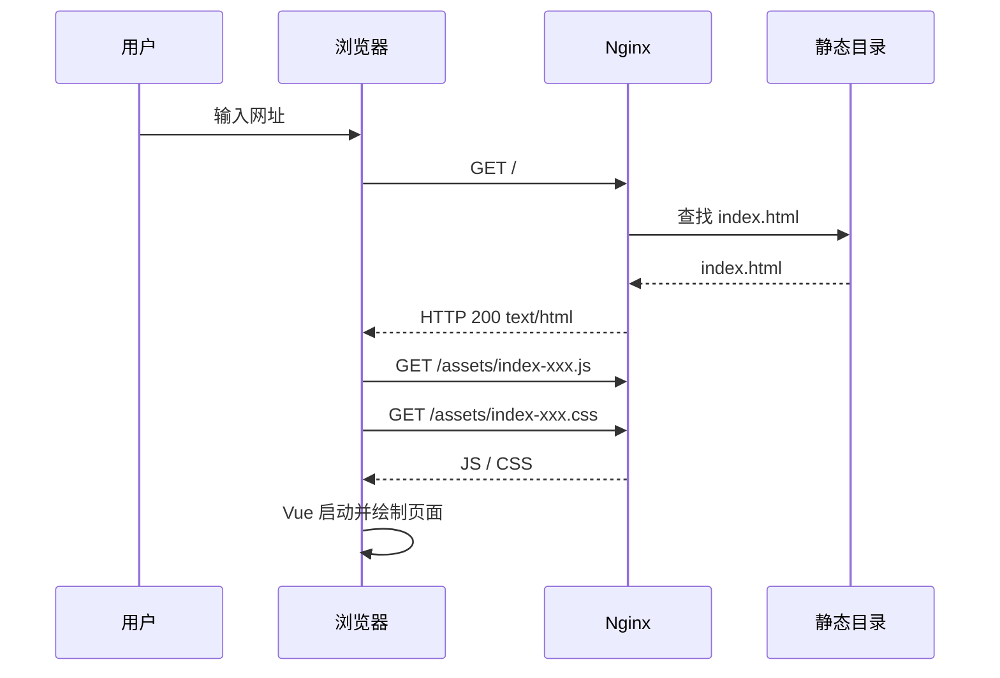

这一阶段通常**不经过 Spring Boot 和 MySQL**。  
Nginx 像前台，直接从文件柜拿出前端构建产物。

### 3.1 Vue Router 为什么刷新子页面仍能显示

浏览器访问 `/cet` 时，服务器磁盘上通常没有一个叫 `/cet` 的真实文件。Nginx 使用：

```nginx
try_files $uri $uri/ /index.html;
```

含义是：

1. 先找真实文件。
2. 再找真实目录。
3. 都没有就返回 `index.html`。
4. Vue Router 启动后读取地址栏 `/cet`，再画出 CET 页面。

类比：前台不知道“CET 办公室”的纸质文件放哪里，于是先把整本办事手册交给你；手册中的目录系统再翻到 CET 那一章。

---

## 4. 登录：公开入口变成有身份会话

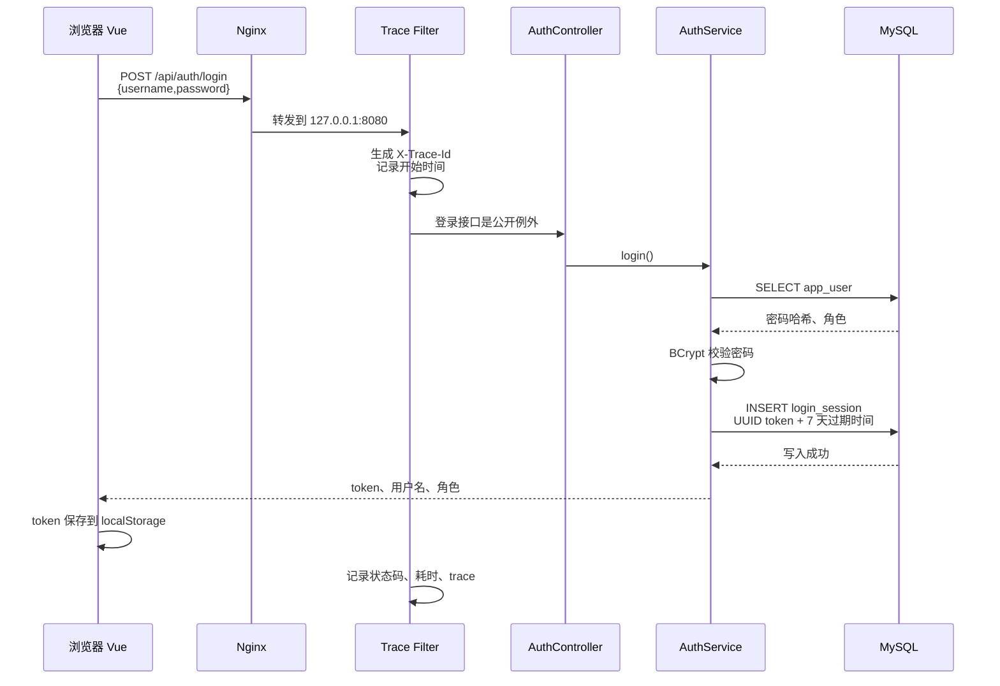

密码不是直接和数据库中的明文比较，而是：

```text
用户输入密码
  → BCrypt 算法验证
  → 与 password_hash 判断是否匹配
```

登录成功后，浏览器保存的 token 类似一张有效 7 天的临时校园卡。之后每次 API 请求自动携带：

```http
Authorization: Bearer <token>
```

## 5. 登录后的普通 API 请求

以加载课程为例：

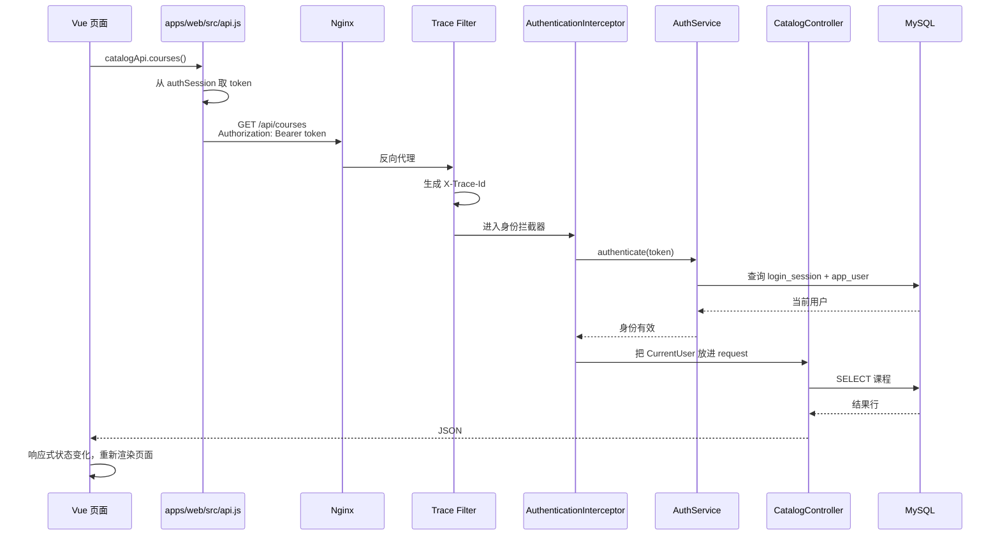

### 5.1 401 和 403 有什么区别

| 状态码 | 含义 | 类比 |
|---|---|---|
| 401 Unauthorized | 没带校园卡、卡无效或过期 | 门卫不知道你是谁 |
| 403 Forbidden | 已知道你是谁，但权限不足 | 你是学生，不能进入校长档案室 |
| 404 Not Found | 目标不存在或对当前状态不可见 | 没有这份档案 |
| 400 Bad Request | 参数不符合规则 | 表格填写错误 |
| 500 Server Error | 服务端内部异常 | 办事系统自身故障 |

管理员接口会在普通登录验证之后，再调用：

```java
auth.requireAdmin(request)
```

所以权限有两层：

```text
第一层：你是不是有效登录用户？
第二层：这个动作是否要求 ADMIN？
```

---

## 6. 上传资料：数据库和文件系统同时参与

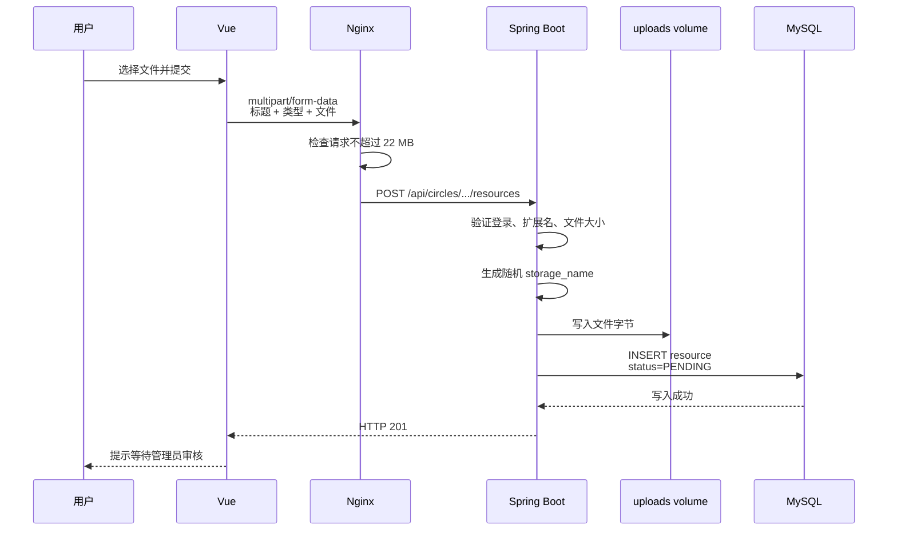

数据库里不会保存整个 PDF，只保存：

```text
title
original_name
storage_name
mime_type
file_size
uploader_id
course_id
teacher_id
status = PENDING
```

### 6.1 一个值得注意的工程边界

当前上传逻辑先写文件，再插入数据库，并在数据库方法上使用事务。数据库失败时 SQL 可以回滚，但已经写入磁盘的文件不一定自动删除。

可以将系统状态写成：

```text
理想状态：数据库记录存在 ⇔ 文件存在
异常状态：数据库记录不存在，但文件已经存在（孤儿文件）
```

后续可增加失败清理或定期孤儿文件扫描，让两种存储保持一致。

---

## 7. 审核资料：状态机模型

资料不是简单的“有或没有”，而是一个状态机：

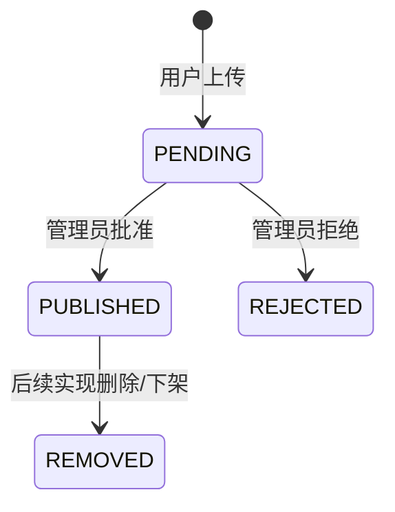

当前公开资料查询带有条件：

```sql
WHERE r.status = 'PUBLISHED'
```

因此“数据库中有这条记录”和“普通用户能看到”是两回事。

可见性函数可以写成：

\[
Visible(r,u)=
\begin{cases}
1, & r.status=\text{PUBLISHED}\\
0, & \text{otherwise}
\end{cases}
\]

管理员审核会写入 `moderation_audit`，相当于给状态变化留下签字：

```text
谁，在什么时间，对哪一条内容，做了批准还是拒绝
```

---

## 8. 打开 PDF：为什么会涉及两类请求

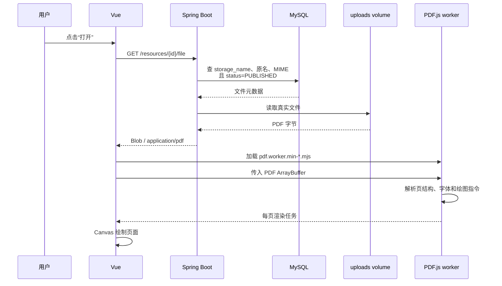

这里有两个完全不同的资源：

1. **用户的 PDF 文件**：从后端 `/api/.../file` 取得，需要登录。
2. **PDF.js worker 程序**：从 Nginx `/assets/*.mjs` 取得，是前端静态代码。

之前的两次故障分别发生在不同层：

| 故障 | 所在层 | 原因 |
|---|---|---|
| worker 动态导入失败 | Nginx / HTTP | `.mjs` 被返回为错误 MIME |
| `getOrInsertComputed` 不存在 | 浏览器 JavaScript 运行时 | 手机浏览器太旧，现代 PDF.js 使用了新 API |

这说明 HTTP 200 只证明“文件送到了”，不证明“浏览器能把它当正确类型执行”，也不证明“执行环境支持代码需要的 API”。

---

# 第三部分：数据库不是一个 Excel 表

## 9. 关系数据库的核心模型

可以把数据库看成多张集合：

\[
Course=\{c_1,c_2,\ldots,c_n\}
\]

\[
Teacher=\{t_1,t_2,\ldots,t_m\}
\]

\[
Resource=\{r_1,r_2,\ldots,r_k\}
\]

每条记录有主键，例如：

\[
id(r_i) \in \mathbb{N}^+
\]

外键把不同集合中的元素连接起来：

\[
r.course\_id = c.id
\]

\[
r.teacher\_id = t.id
\]

## 10. 项目核心实体关系图

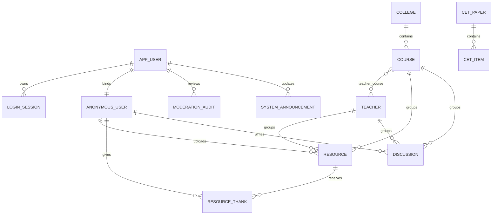

### 10.1 JOIN 是什么

资料表只有 `course_id`，没有把课程名称重复存一遍。要显示课程名称，需要连接：

```sql
SELECT r.title, c.name
FROM resource r
JOIN course c ON c.id = r.course_id;
```

可以把 JOIN 理解为“按学号把两张花名册横向拼起来”。

数学上，它接近带条件的笛卡尔积：

\[
Resource \bowtie_{Resource.course\_id=Course.id} Course
\]

如果没有索引，数据库可能需要大量逐项比较；主键、外键和索引相当于书后的字母索引，帮助数据库快速定位。

## 11. 事务是什么

事务希望一组数据库操作满足 ACID：

- **Atomicity 原子性**：要么全成功，要么全失败。
- **Consistency 一致性**：操作前后都满足约束。
- **Isolation 隔离性**：并发操作尽量互不干扰。
- **Durability 持久性**：提交后即使进程重启也不丢。

例如“点赞一次”需要避免重复：

```text
向 resource_thank 插入 (resource_id, user_id)
  → 若确实新增
  → resource.thanks_count + 1
```

唯一约束使同一用户不能对同一资料重复产生多条感谢记录。

---

# 第四部分：把整个项目抽象成数学图

## 12. 有向图模型

定义系统为带属性的有向图：

\[
G=(V,E)
\]

节点集合：

\[
V=\{Browser,Nginx,Static,Backend,MySQL,Uploads\}
\]

边集合：

\[
E=\{
Browser\rightarrow Nginx,
Nginx\rightarrow Static,
Nginx\rightarrow Backend,
Backend\rightarrow MySQL,
Backend\rightarrow Uploads
\}
\]

每条边不是只有“连着”这一属性，还可以带权：

\[
e=(source,target,latency,bandwidth,reliability,permission)
\]

例如公网边：

\[
e_{wan}=(Browser,Nginx,L_{wan},3Mbps,p_{wan},HTTP)
\]

后端数据库边：

\[
e_{db}=(Backend,MySQL,L_{db},B_{docker},p_{db},DBCredential)
\]

## 13. 请求路径和总延迟

一次普通 API 请求路径：

\[
P_{api}=Browser\rightarrow Nginx\rightarrow Backend\rightarrow MySQL
\rightarrow Backend\rightarrow Nginx\rightarrow Browser
\]

粗略总延迟：

\[
T_{api} \approx
2T_{wan}+2T_{proxy}+T_{auth}+T_{controller}+T_{sql}+T_{serialize}
\]

打开 PDF 还要加文件读取和传输：

\[
T_{pdf} \approx T_{api}+T_{disk}+\frac{S_{pdf}}{B_{wan}}+T_{parse}+T_{render}
\]

其中：

- \(S_{pdf}\)：PDF 大小。
- \(B_{wan}\)：实际可用公网带宽。
- \(T_{parse}\)：PDF worker 解析时间。
- \(T_{render}\)：Canvas 绘制时间。

3 Mbps 是比特每秒，不是 MB/s：

\[
3Mbps \div 8 \approx 0.375MB/s
\]

理想情况下传输 10 MB 文件至少需要：

\[
10 \div 0.375 \approx 26.7秒
\]

实际还会受协议开销、共享带宽和网络波动影响，所以时间更长。

## 14. 可用性是串联系统

一次业务请求需要多个组件同时工作，可近似看作串联系统：

\[
A_{total}=A_{network}\times A_{nginx}\times A_{backend}\times A_{mysql}
\]

假设每层可用性都是 99%：

\[
A_{total}=0.99^4\approx96.06\%
\]

单个组件看起来都“挺稳定”，串起来以后整体可用性会下降。

静态首页的路径更短：

\[
A_{static}=A_{network}\times A_{nginx}\times A_{disk}
\]

因此可能出现：

```text
首页能打开，但登录或课程加载失败
```

这往往意味着静态链路正常，API 链路中的后端、鉴权或数据库存在问题。

## 15. 最小割与单点故障

在图 \(G\) 中，删除某个节点后用户无法到达业务数据，该节点就是关键割点。

当前主要单点：

- 一台云服务器。
- 一个 Nginx 实例。
- 一个 Spring Boot 实例。
- 一个 MySQL 实例。
- 一个 uploads volume。

删除 Nginx：

\[
Browser \not\rightsquigarrow Backend
\]

删除 MySQL：

\[
Backend \text{ 进程可能仍在，但多数业务不可完成}
\]

备份不是提高“当下可用性”，而是提高故障后的“可恢复性”。

---

# 第五部分：数据、控制与观察三条流

## 16. 三种不同的流

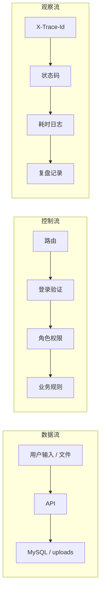

- **数据流**回答：数据去了哪里？
- **控制流**回答：为什么允许或拒绝？
- **观察流**回答：出错后怎么知道发生了什么？

每个 API 响应包含 `X-Trace-Id`。后端日志记录：

```text
trace
HTTP method
path
status
duration_ms
```

所以用户报告错误时，最有价值的信息组合是：

```text
发生时间 + 操作步骤 + 错误文字 + X-Trace-Id
```

---

# 第六部分：启动、更新和重启时发生什么

## 17. 后端容器启动

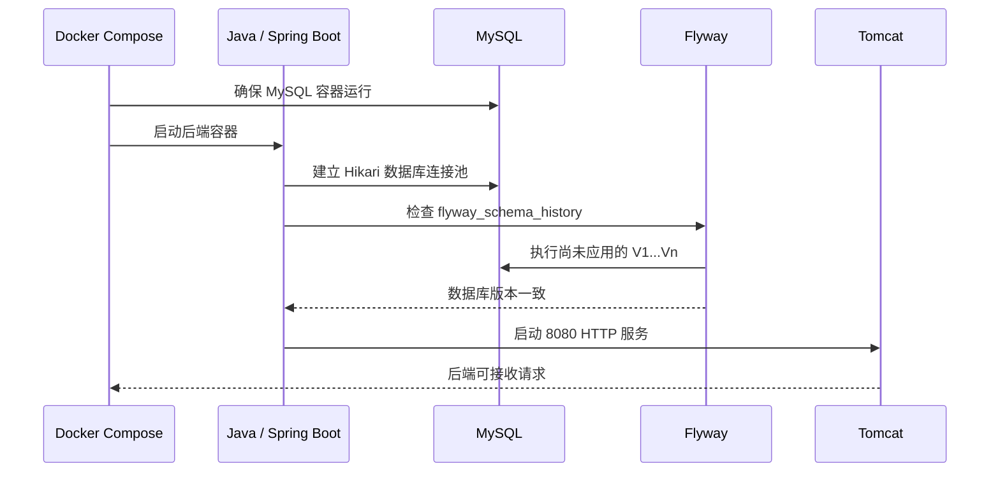

Flyway 把数据库结构变化看作有序序列：

\[
Schema_0 \xrightarrow{V1} Schema_1
\xrightarrow{V2}\cdots
\xrightarrow{V15} Schema_{15}
\]

已经在生产执行的迁移不能修改，否则校验和会变化。下一次结构调整应增加 V16，而不是重写 V15。

## 18. 前端更新为什么不需要重启后端

前端生产文件只是 Nginx 读取的静态文件：

```text
npm run build
  → dist/
  → 上传临时目录
  → 备份旧 /var/www/finals-compass
  → 原子切换新目录
```

Nginx 的根目录路径不变，只是该路径指向了新文件，因此通常不需要重启 Spring Boot。

后端更新则需要：

```text
新 JAR
  → 构建 Docker image
  → 重建 backend 容器
  → Flyway 检查迁移
  → 健康检查
```

---

# 第七部分：怎样从症状反推故障节点

## 19. 症状到网络图节点的映射

| 症状 | 首先怀疑 | 检查 |
|---|---|---|
| 整个网站打不开 | 网络 / Nginx / 80 端口 | 公网 curl、Nginx 状态 |
| 首页能开，所有 API 失败 | Nginx `/api` 代理 / 后端 | `/api/system/health` |
| 健康正常，但登录失败 | 账号、密码哈希、会话 | 登录状态码和 trace |
| 登录正常，课程为空 | SQL 条件 / 数据迁移 | API JSON、数据库行数 |
| 资料列表有，文件 404 | uploads 与 metadata 不一致 | storage_name、volume 文件 |
| PDF 下载正常，内置预览失败 | worker / MIME / 浏览器兼容 | worker 状态码、MIME、控制台 |
| 管理员能看但不能修改 | ADMIN 权限 / 请求体校验 | 403/400、trace |
| 容器 Up 但 8080 重置 | 容器监听地址 | `SERVER_ADDRESS`、端口监听 |

## 20. 四层验收，而不是只看“容器 Up”

```text
第 1 层：进程
docker compose ps / systemctl status nginx

第 2 层：网络与接口
首页 200 / health 200 / 静态资源 MIME 正确

第 3 层：数据
Flyway 版本 / 表和行 / 文件是否存在

第 4 层：真实业务
登录 / 上传 / 审核 / 打开 PDF / 管理员编辑
```

只有四层都通过，才叫业务闭环。

---

# 第八部分：把知识重新串起来

## 21. 一次请求的“七问”

看到任何功能时，都可以问：

1. **谁发起？** 浏览器中的哪个组件？
2. **发到哪里？** 静态路径还是 `/api`？
3. **谁分流？** Nginx 怎样匹配 location？
4. **谁验证？** token 是否有效，是否需要 ADMIN？
5. **谁执行？** 哪个 Controller / Service？
6. **数据在哪？** MySQL 行还是 uploads 文件？
7. **如何证明？** 状态码、响应、trace、数据库和页面是否一致？

## 22. 最小心智模型

如果很久没碰网络和数据库，只需要先牢牢记住这条主链：

```text
用户操作
  ↓
Vue 把操作变成请求
  ↓
Nginx 判断“静态文件还是 API”
  ↓
Spring 验证登录和权限
  ↓
Controller 执行业务
  ↓
MySQL 管记录，uploads 管文件
  ↓
JSON 或文件字节返回
  ↓
Vue 更新状态，浏览器重新绘制
```

数学上，它是一个有权限约束、状态转换和持久化节点的有向图：

\[
Result =
Render(
Response(
Business(
Authorize(
Route(Request)
))))
\]

只要沿着这条函数复合链逐层检查，就不会把“页面问题、网络问题、权限问题、数据库问题和文件问题”混在一起。

---

## 23. 与六点工程闭环的对应关系

| 六点闭环 | 在这张系统图中的作用 |
|---|---|
| 定义任务边界 | 明确准备改哪些节点和边 |
| 整理上下文与检索 | 先确认当前拓扑、数据和配置事实 |
| 工具与权限 | 明确谁能访问 Nginx、Docker、MySQL、ADMIN 接口 |
| 人工确认 | 在迁移、覆盖、删除和上线前设置闸门 |
| 可评测 | 对进程、网络、数据和业务四层验收 |
| 监控、定位与复盘 | 用 trace 沿请求路径定位故障并记录防复发动作 |

当一次更新修改了某条边，例如：

```text
Nginx → .mjs 静态资源
```

验收就不能只看整个系统，而要直接测这条边：

```text
状态码是否 200？
Content-Type 是否 application/javascript？
浏览器是否支持该模块需要的 API？
实际 PDF 是否完成渲染？
```

这就是“把项目看成网络模型”对实际工程最有价值的地方。
